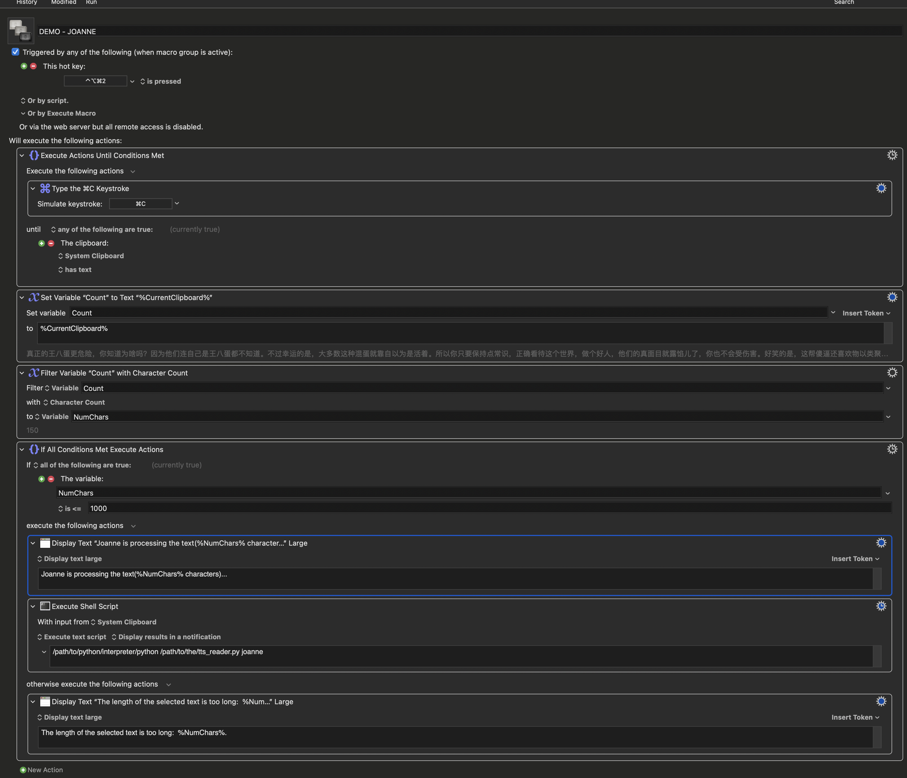

This document assumes you're already familiar with running Python in a virtual environment and are comfortable using Keyboard Maestro. I won't delve into the details of setting up Python or building Keyboard Maestro macros.

# Getting `tts_reader.py` Ready 

1. Obtain your Eleven Labs API key and add it to the `.env` file:

```plaintext
XI_API_KEY=YOUR_KEY
```

2. Define the temporary file path for storing the audio file in `settings.py`:

```python
TEMP_AUDIO_FILE = "/Users/USERNAME/_temp_tts_audio.mp3"
```

3. Uncomment the `get_voices()` function to retrieve your voice IDs:

```python
if __name__ == "__main__":
    # main()
    get_voices()
```

4. Add the retrieved voice IDs to the `VOICE_IDS` dictionary in `settings.py`:

```python
VOICE_IDS = {
    'default': "DEFAULT_ID",
    "joanne": "JOANNE_ID"
}
```

5. Uncomment the `main()` function and comment out `get_voices()` after you've set up the voices:

```python
if __name__ == "__main__": 
    main()
    # get_voices()
```

6. Test the setup by running `tts_reader.py`. If everything is configured correctly, you should hear the default voice.

# Integrating with Keyboard Maestro

Let's say you want to use a shortcut to have Joanne read any selected text.



There’s a conditional block to limit the text length to 1000 characters to avoid issues. Adjust this limit as needed, but don't set it too high—processing overly lengthy text could cause problems.

The process is straightforward. Pressing the shortcut executes `tts_reader.py` using the Python interpreter that can run the script. Make sure to set the path to your Python executable in your virtual environment. If MacOS security blocks the script, you might need to manually allow it, as MacOS often doesn't favor third-party apps running shell scripts.

```bash
/path/to/python/interpreter/python /path/to/the/tts_reader.py joanne
```

`tts_reader.py` accepts a command line argument for the voice name, which corresponds to the name and ID pairs you set up in `VOICE_IDS` in `settings.py`:

```python
VOICE_IDS = {
    'default': "id",
    "joanne": "joanne_id"
}
```

You can add multiple pairs. Just ensure that you use the correct key as the command-line argument.

For example, if you want to use another voice named "pippa" with a different shortcut:

```python
VOICE_IDS = {
    'default': "id",
    "joanne": "joanne_id",
    "pippa": "pippa_id"
}
```

Copy Joanne’s Keyboard Maestro macro and modify the argument accordingly:

```bash
/path/to/python/interpreter/python /path/to/the/tts_reader.py pippa
```

In summary, when you select some text and press the shortcut, `tts_reader.py` sends an API request to ElevenLabs, retrieves the audio file generated by the selected voice, saves it to the designated temporary file, and plays it.

Note that ElevenLabs voices are dataset-trained AIs, not based on any traditional TTS engine. They sound very natural, but occasionally they might do strange things or mispronounce words, particularly with non-English languages.